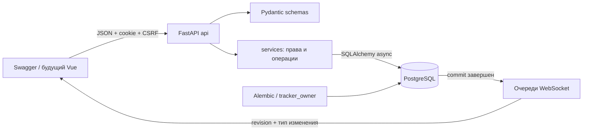
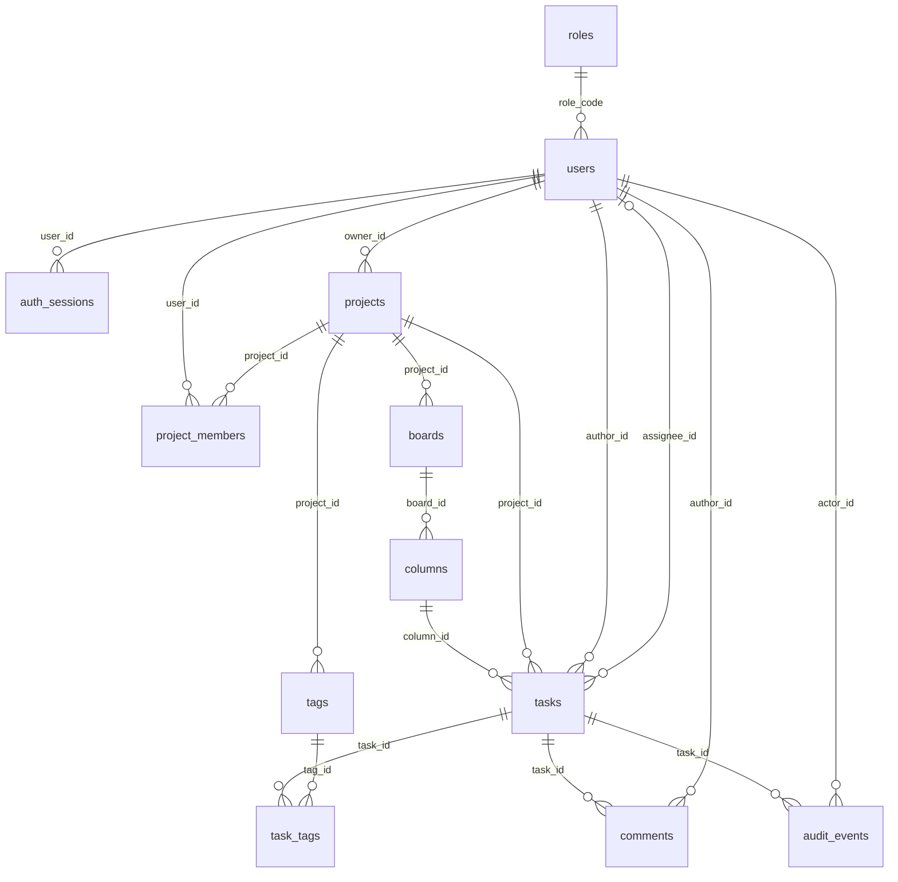

# Архитектура серверной части

## Почему модульный монолит

Все серверные функции выполняются одним FastAPI-приложением. Это позволяет атомарно
сохранить задачу, историю и версию доски в PostgreSQL, не вводя распределенные транзакции.
Для четырех участников и учебного объема отдельные сервисы создали бы дополнительные
проблемы запуска, доставки событий и диагностики. Модули разделены по ответственности,
поэтому границы предметной области остаются видимыми внутри одного приложения.

`api` разбирает HTTP-контракт и выбирает сервис. `schemas` проверяет допустимые значения.
`services` проверяет права и инварианты; это место бизнес-правил, которые нужны и HTTP,
и учебному seed. `db` описывает хранение и соединения. `core` содержит общие механизмы,
не привязанные к конкретной задаче: конфигурацию, ошибки, пароль и JWT.

## Схема данных

Повторяющиеся `project_id` и `board_id` в задаче ускоряют частые выборки. Составные внешние
ключи запрещают привязать задачу к колонке другой доски или к доске другого проекта.
Проверки приложения дополнительно дают понятную ошибку 422 вместо внутренней ошибки SQL.

Владелец проекта обязан состоять в его участниках. Внешний ключ проверяется в конце
транзакции: проект и первое членство можно создать атомарно, несмотря на взаимную связь.

## Роли и границы доступа

Глобальная роль отвечает за системные полномочия. `pm` может создавать проекты;
`admin` управляет учетными записями и явно имеет доступ ко всем проектам. Членство
отвечает за доступ к конкретному проекту, а `owner_id` — за управление им.
Таким образом, PM одного проекта не получает доступ к чужой работе автоматически.

Проверка проходит по всей цепочке ресурса. Недоступный проект, задача, история или
аналитика возвращают 404. Запрещенная операция над видимым ресурсом возвращает 403.
Назначение исполнителя и тегов проверяется отдельно: принадлежность нельзя подменить
передачей UUID в теле запроса.

## Почему cookie и серверная сессия используются вместе

JWT защищает содержимое сессии от подмены и ограничивает срок. HttpOnly cookie не дает
клиентскому JavaScript читать JWT. Запись `auth_sessions` позволяет немедленно отозвать
одну сессию при выходе; роли и членство перечитываются из БД, поэтому старый JWT
не сохраняет отозванные полномочия. CSRF-токен и Origin защищают операции изменения
при автоматической отправке cookie браузером.

## Как сохраняется конкурентная правка

1. Определяется проект ресурса; блокировки берутся в порядке Project → Board → Task.
2. После получения блокировки повторно проверяются текущие права и `expected_version`.
3. Меняется задача и порядок затронутых колонок. Соседние технические позиции
   не меняют пользовательскую версию соседних задач.
4. Аудит и новая `board.revision` записываются в той же транзакции.
5. После commit событие ставится в ограниченную очередь соединений.

У двух правок одной версии только одна может успешно сохраниться. Вторая получает
409 и перечитывает данные. Это предотвращает незаметную потерю текста другого участника.
При отсутствии фактического изменения сохраняются прежние версия, история и revision.

## Почему WebSocket передает уведомление, а не полную карточку

Авторитетный источник — HTTP-снимок в REPEATABLE READ. Клиент получает `board_revision`
и перечитывает снимок, когда он отстает. Это уменьшает количество правил слияния на Vue:
один снимок содержит согласованные колонки, задачи, участников и теги.
Heartbeat берет revision из БД, поэтому обнаруживает даже потерю push после commit.

Очередь каждого сокета ограничена, а право доступа проверяется перед каждой отправкой.
Медленный клиент не блокирует остальные. Реализация рассчитана на **один worker**;
несколько процессов требуют общего канала событий и отдельного решения масштабирования.

## Почему история не переписывается

Удаление задачи мягкое: задача исчезает с доски, но история доступна по прямому маршруту.
В аудите сохраняются ID и подписи ссылочных значений на момент операции. Переименование
тега сегодня не меняет смысл вчерашнего события. Runtime-роль БД имеет только SELECT
и INSERT для аудита; триггер дополнительно запрещает UPDATE, DELETE и TRUNCATE.

## Аналитика

Распределение по колонкам показывает текущее состояние активных задач. График завершений
использует самое раннее `task.completed` каждой задачи. Повторное открытие и завершение
не удваивает выполненную работу, а мягкое удаление не стирает прошлый результат.
Даты группируются в часовом поясе проекта; пустые дни возвращаются с нулями.
