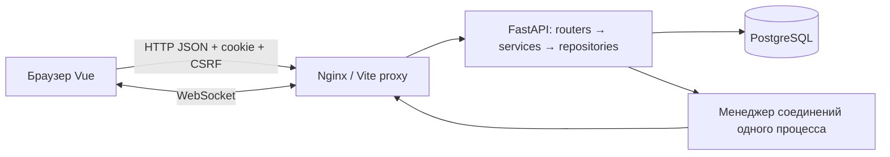

# Internal Task Tracker — спецификация продукта и разработки

Версия: 1.0 · Дата: 2026-09-09 · Назначение: единый исходный документ для команды и Claude Code.

Это спецификация будущей реализации, не отчет о готовом приложении. Код продукта пока отсутствует. Документ можно передать целиком одному Claude; для параллельной работы каждому дополнительно назначается одна карточка из раздела 18 или `TEAM_ROADMAP.md`.

## 1. Контекст, источники и решения

### 1.1 Подтверждено DevVolodya

- Учебный корпоративный таск-трекер по заданию 2: проекты, Kanban, RBAC, WebSockets, аудит, аналитика.
- Стек команды: **FastAPI + Vue.js**.
- Четыре участника: Казаков Виталий, Рассказов Максим, Исмагулов Саян, Долматова Мария.
- Саян преимущественно занимается фронтендом; Виталий, Максим и Мария — бэкендом. Работа совместная, зоны ответственности пересекаются.
- Claude Code на Windows и macOS. Нужен рабочий путь для Mac с Apple Silicon.
- Горизонт до трех месяцев, допускается ранняя сдача; пять промежуточных мини-отчетов и итоговая презентация.
- Нравятся Jira и Битрикс24; нужны удобство, цельный интерфейс и полезные дополнительные функции.
- Репозиторий: [MaximaRasskazov/internal-task-tracker](https://github.com/MaximaRasskazov/internal-task-tracker). При проверке 2026-09-09 основная ветка — `release`, в ней только `README.md` с названием проекта.

Опыт, часы в неделю и конкретные календарные даты промежуточных проверок не сообщены. План не выдает их за известные факты.

### 1.2 Иерархия требований

Задание курса и дополнения о пяти отчетах задают обязательный результат. Эта редакция уточняет реализацию. Файл друга — исходный проект документа: его float-позиции, last-write-wins и передача JWT в URL не являются требованиями преподавателя.

Обязательные требования имеют исходные ID `BE-01…BE-11`, `FE-01…FE-06`, `NFR-01…NFR-09`. Все 26 сохранены в разделе 17. Упоминание стандартов в задании не означает сертификацию по ISO.

### 1.3 Рабочие решения этой редакции

Следующие решения предложены для согласованной реализации; они не приписываются преподавателю или уже состоявшемуся голосованию команды. До изменения через T00 все исполнители используют одну эту версию.

| Решение | Выбранный вариант и причина |
|---|---|
| Язык продукта | Русский интерфейс; английские имена кода и API. Пользователь не указал иной язык |
| Название | Internal Task Tracker; нейтральное рабочее название до выбора бренда |
| Клиент | Vue 3, TypeScript, Vite; типы API уменьшают расхождения с Python-бэкендом |
| Хранилище | PostgreSQL; SQLAlchemy 2 async + Alembic; реляционные связи и транзакции |
| Роли | Глобальная роль отдельно от членства и владельца проекта; администратор имеет явный доступ ко всем проектам |
| Аутентификация | Подписанный JWT в HttpOnly cookie; серверная сессия для выхода и отзыва; CSRF-защита |
| Порядок карточек | Целочисленный порядок вычисляет сервер в транзакции; клиент присылает соседнюю карточку |
| Конкурентные правки | `expected_version` задачи; конфликт отклоняется с 409. Серверный `board_revision` определяет свежесть снимка |
| Real-time | Нативный WebSocket, события после commit, повторный снимок при изменениях и reconnect |
| Завершение | У колонки есть семантическая категория `todo`, `in_progress` или `done`; название произвольное |
| Удаление | Задачи — мягкое удаление; непустые контейнеры не удаляются; история сохраняется |
| Интерфейс | Светлая тема по умолчанию, тёмная при полировке; доска, подробная карточка, явные фильтры и состояния |
| Объем первого релиза | Все требования курса; дополнительные функции не вытесняют обязательные |

Обычный PR проверяет другой участник. Изменение контракта согласуют его производитель и потребитель; изменение общего объема подтверждают все четверо. Решение сопровождается причиной, затронутыми API/данными/задачами и обновлением этой спецификации в том же PR. Не нужно согласовывать с командой локальные имена переменных или расположение приватного компонента.

## 2. Цель, границы и критерий качества

Пользователь должен понимать, что нужно сделать, кто отвечает, когда срок и как продвигается работа. Основной сценарий: создать проект → доску → свои колонки → задачу → назначить исполнителя и срок → переместить → увидеть изменения у коллеги и в истории → проверить фильтры и аналитику.

**Обязательный релиз:** JWT, серверный RBAC, проекты/участники, несколько досок, произвольные колонки, все поля задачи, теги, комментарии, аудит, DnD, пять видов комбинируемых фильтров, WebSockets, два графика, мобильные ключевые сценарии, тесты, документация, Docker и CI.

**После обязательного релиза:** быстрое создание, «Мои задачи», горячие клавиши, тёмная тема; затем при наличии времени WIP-подсказки и сохраненные фильтры. Их точное поведение определено в разделе 16.

**Не планируются:** SSO, корпоративный биллинг, Git-интеграции, спринты/capacity planning, файловые вложения, чат, видеозвонки, email/push-уведомления, AI-генерация задач, редактирование офлайн, иерархия подзадач, перенос задач между досками. Сброс пароля и подтверждение email не входят в учебный релиз. Новые идеи сначала оцениваются в бэклоге.

Качественный результат измеряется выполнением приемки, отсутствием критических дефектов доступа/данных, удобным демо, чистым запуском и возможностью каждого участника объяснить свои изменения. Обещание «без багов» критерием не является.

## 3. Архитектура и среда запуска

### 3.1 Стек

| Область | Единый выбор |
|---|---|
| Python | Python 3.13; зависимости и lockfile через uv |
| API | FastAPI, Pydantic 2, Uvicorn |
| БД | PostgreSQL 18; SQLAlchemy 2 async, asyncpg, Alembic |
| Auth | PyJWT с фиксированным алгоритмом HS256; pwdlib с Argon2id |
| Frontend | Vue 3 Composition API, TypeScript strict, Vite, Vue Router, Pinia |
| UI | PrimeVue, единые CSS-токены проекта; одна тема компонентов, без смешивания UI-библиотек |
| Данные клиента | Один типизированный fetch-клиент; Pinia хранит сессию и состояние открытой доски |
| DnD | SortableJS через один собственный Vue-адаптер; альтернативное управление через меню |
| Графики | Chart.js; рядом с графиками доступная таблица значений |
| Frontend runtime | Node.js 24, npm; `package-lock.json`, установка через `npm ci` |
| Проверки | pytest + httpx для API, реальный PostgreSQL для интеграции; Vitest + Vue Test Utils; Playwright для E2E |
| Статика | Ruff check/format, mypy; ESLint, Prettier, vue-tsc |
| Инфраструктура | Docker Compose, Nginx для клиента и прокси API/WS, GitHub Actions |

Это целевые major-линии, а не заявление о проверенной совместимости конкретных пакетов. В T01 устанавливаются совместимые версии, выполняется smoke-проверка на Windows/macOS, сохраняются точные lockfiles и версии базовых образов. Нельзя независимо обновлять major-версии в четырех ветках. Нельзя использовать тег образа `latest` как фиксацию версии. Источники выбранных UI-инструментов: [PrimeVue](https://primevue.org/), [SortableJS](https://github.com/SortableJS/Sortable), [Chart.js](https://www.chartjs.org/docs/latest/).

Vue официально поддерживает связку TypeScript/Vite; проверка типов запускается отдельно от сборки через vue-tsc. [Документация Vue](https://vuejs.org/guide/typescript/overview.html). uv хранит согласованный набор зависимостей проекта в lockfile. [Документация uv](https://docs.astral.sh/uv/guides/projects/).

### 3.2 Компоненты



Клиент никогда не подключается к основной БД. Бизнес-правила находятся в service-слое; роуты разбирают HTTP и вызывают сервисы; репозитории работают с данными. Pydantic DTO не заменяют проверки связей и прав.

Одна `AsyncSession` на запрос/операцию; ее нельзя делить между параллельными задачами. [SQLAlchemy](https://docs.sqlalchemy.org/en/20/orm/extensions/asyncio.html). Хэширование пароля не блокирует event loop: выполняется через threadpool.

Базовая инфраструктура запускает **один процесс API** (`workers=1`) и один экземпляр приложения. Менеджер WebSocket в памяти не обеспечивает рассылку между независимыми worker-процессами. [FastAPI](https://fastapi.tiangolo.com/advanced/websockets/). Масштабирование через Redis/pub-sub — отдельное будущее изменение, не скрытая зависимость учебного релиза.

### 3.3 Windows и macOS

Основной путь для сдачи — Docker Desktop с Linux-контейнерами и Compose. На Windows документируется WSL2/Linux containers; на Apple Silicon используются образы arm64 без принудительного `platform: linux/amd64`. Образы и зависимости проверяются на обеих архитектурах. Docker поддерживает многоархитектурные сборки, но наличие нужной архитектуры у выбранного тега проверяется отдельно. [Docker](https://docs.docker.com/build/building/multi-platform/).

Режим разработки: БД в Compose; API через uv, Vue через npm на хосте. Vite проксирует `/api` и `/ws` к API; браузер видит один origin. Команды проекта не зависят от Bash-only конструкций. Миграции запускает отдельная команда/сервис перед стартом API, не каждый запрос и не каждый worker.

### 3.4 Предлагаемая структура будущего репозитория

```text
internal-task-tracker/
  product_spec.md
  CLAUDE.md
  TEAM_ROADMAP.md
  README.md
  backend/
    pyproject.toml
    uv.lock
    app/
      main.py
      core/              # конфигурация, auth dependencies, ошибки
      db/                # engine, sessions, общая модель
      modules/
        auth/
        users/
        projects/
        boards/
        tasks/
        tags/
        comments/
        audit/
        analytics/
        realtime/
      cli/               # init-env, seed, bootstrap admin, export OpenAPI
    migrations/
    tests/
    Dockerfile
  frontend/
    src/
      app/               # router, stores, providers
      api/               # fetch, generated types, ошибки
      components/        # общие компоненты
      features/          # auth, projects, board, task, analytics, admin
      styles/            # токены, темы, общие стили
    tests/
    package.json
    package-lock.json
    Dockerfile
  e2e/
  infra/nginx.conf
  docs/
    api/openapi.json
    architecture.md
    er.md
    websocket.md
    decisions.md
    reports/
    evidence/
    demo.md
  .github/workflows/ci.yml
  compose.yaml
  compose.dev.yaml
  .env.example
```

Дерево — целевая структура, не результат чтения существующего кода. Внутри каждого модуля backend: `router.py`, `schemas.py`, `service.py`, `repository.py`; модели можно хранить в `models.py` модуля, а регистрацию metadata собрать централизованно. Не создаются пустые файлы для видимости готовности.

## 4. Роли и правила доступа

### 4.1 Три разных понятия

- `User.role`: `admin`, `pm`, `developer`. Глобальная роль `pm` разрешает создавать проекты; `admin` управляет учетными записями и имеет явный полный проектный доступ.
- `ProjectMember`: пользователь входит в конкретный проект; глобальный PM не видит чужой проект без членства.
- `Project.owner_id`: руководитель конкретного проекта. Это локальное полномочие управления проектом. В интерфейсе называется «Руководитель проекта», а не второй глобальной ролью PM.

Создатель проекта автоматически становится владельцем и участником. Смена его глобальной роли с `pm` на `developer` запрещает создание новых проектов, но не отнимает владение уже созданными. Передача владения разрешена активному существующему участнику независимо от его глобальной роли. Членство владельца удалить нельзя до передачи владения.

### 4.2 Матрица

«Участник» ниже — активный участник данного проекта, который не владелец. Администратор имеет явное исключение из требования членства для чтения и управления; назначить исполнителем все равно можно только активного участника.

| Действие | Admin | Владелец | Участник | Посторонний |
|---|---|---|---|---|
| Список/чтение проекта, досок, задач, тегов, истории, аналитики | Все проекты | Да | Да | Нет |
| Создать проект | Да | Только при глобальной роли pm/admin | Только при глобальной роли pm/admin | Только при глобальной роли pm/admin |
| Изменить проект, передать владение | Да | Да | Нет | Нет |
| Добавить/удалить участников | Да | Да | Нет | Нет |
| Создать/изменить/упорядочить/удалить доску и колонку | Да | Да | Нет | Нет |
| Создать/редактировать/двигать задачу, назначать исполнителя и теги | Да | Да | Да | Нет |
| Удалить задачу | Да | Да | Только автор задачи | Нет |
| Создать тег проекта | Да | Да | Да | Нет |
| Переименовать/удалить тег | Да | Да | Нет | Нет |
| Добавить комментарий | Да | Да | Да | Нет |
| Редактировать/удалять комментарии | Нет API | Нет API | Нет API | Нет |
| Изменить историю | Никому через приложение | Никому | Никому | Никому |
| Список пользователей системы, глобальные роли | Да | Нет | Нет | Нет |

Авторство или назначение задачи не дает доступа после исключения из проекта. Администратор может менять роли других пользователей, но не свою; понижение последнего активного admin запрещено. Регистрация всегда создает `developer`; поля `role`, `owner_id`, `author_id` не принимаются от клиента там, где их определяет сервер.

### 4.3 Изоляция и пограничные случаи

- Неаутентифицированный запрос: 401. Ресурс существует, но проект недоступен: 404 без раскрытия названия/владельца. Видимый ресурс, запрещенная операция: 403.
- Проверяется весь путь task → column → board → project; аналогично comment, tag, history и analytics. Нельзя доверять одному `project_id` из запроса.
- Ассignee, теги и целевая колонка проверяются сервером. Тег только из проекта задачи; колонка только из ее доски; исполнитель — активный участник проекта.
- Добавление участника: по точному email уже зарегистрированного пользователя. Полный каталог пользователей виден только admin; поиск по префиксу для всех не нужен.
- Удаление участника не стирает авторство, комментарии и аудит. Старые назначения сохраняются с пометкой «Больше не участник»; новые назначения на него запрещены. Если PATCH передает неизменившийся assignee_id, старое назначение допустимо; проверка действующего членства нужна при фактическом новом назначении. Пропуск поля сохраняет значение, null снимает назначение. Владелец может переназначить задачи.
- Роли и членство читаются из БД при авторизации операции, не из устаревшего JWT. Активные сокеты потерявшего доступ пользователя закрываются после изменения доступа.

## 5. Данные и инварианты

### 5.1 Общие форматы

- ID — UUID, в JSON строка. Технические `revision`, `version`, `position`, счетчики — целые числа.
- API использует `snake_case` и типы Pydantic; TypeScript DTO генерируются из OpenAPI. Преобразование в camelCase только внутри UI, без изменения транспортного контракта.
- Timestamp — ISO 8601 UTC с `Z`, хранение `timestamptz`. Deadline — **календарная дата `YYYY-MM-DD`**, хранение `date`; она не сдвигается при смене часового пояса браузера.
- Календарные расчеты проекта используют `Project.timezone`, IANA timezone; по умолчанию `UTC`, выбирается при создании и далее неизменна в первом релизе.
- Начальная `version=1`, `revision=0`; сервер увеличивает значения, клиент не назначает их.
- Мягко удаленные задачи не входят в обычные списки, число активных задач и распределение статусов. Исторические события выполнения сохраняются.

### 5.2 Таблицы

| Сущность | Поля и ограничения |
|---|---|
| Role | `code` PK: admin/pm/developer; `name`; три записи миграции |
| User | `id`, `name`, `email`, `password_hash`, `role_code` FK Role, `is_active=true`, `created_at`; unique нормализованный email |
| AuthSession | `id`, `user_id`, `csrf_hash`, `created_at`, `expires_at`, `revoked_at` nullable; JWT содержит session id, запись позволяет отозвать конкретную сессию |
| Project | `id`, `key`, `name`, `description`, `owner_id`, `timezone`, `next_task_number=1`, `created_at`, `updated_at`; `key` уникален и неизменен |
| ProjectMember | составной PK `project_id,user_id`, `joined_at`; владелец обязательно участник |
| Board | `id`, `project_id`, `name`, `revision=0`, `created_at`, `updated_at` |
| Column | `id`, `board_id`, `name`, `category`, `position`, `created_at`; категория todo/in_progress/done; порядок 0…n−1 |
| Task | `id`, `project_id`, `board_id`, `number`, `title`, `description`, `column_id`, `position`, `priority`, `author_id`, `assignee_id` nullable, `deadline` nullable, `story_points` nullable, `version=1`, `created_at`, `updated_at`, `deleted_at` nullable |
| Tag | `id`, `project_id`, `name`, `color`; unique `(project_id,normalized_name)` |
| TaskTag | PK `task_id,tag_id`; обе сущности принадлежат одному проекту |
| Comment | `id`, `task_id`, `author_id`, `text`, `created_at`; добавление без редактирования и удаления в этом релизе |
| AuditEvent | `id`, `task_id`, `project_id`, `board_id`, `operation_id`, `event_type`, `changes` JSONB, `actor_id`, `occurred_at`; append-only для роли БД приложения |

Денормализованные `Task.project_id` и `board_id` обеспечивают индексы и фильтры; составные FK/unique-ограничения фиксируют соответствие task.board → board.project и task.column → column.board. Для TaskTag проект проверяется сервисом в той же транзакции; межпроектная связь не должна быть доступна через API.

Минимальные индексы: membership по user; board по project; column по `(board_id,position)`; task по `(board_id,column_id,position,id)` для активных; task по `(project_id,assignee_id,deadline)`; TaskTag в обоих направлениях; comment по `(task_id,created_at,id)`; audit по `(task_id,occurred_at,id)` и `(project_id,event_type,occurred_at)`; unique `(project_id,number)`.

`Task.key` — вычисляемое публичное поле `Project.key + '-' + number`, например `TEAM-42`. Номер резервируется под блокировкой Project в транзакции создания; удаленные номера не переиспользуются.

### 5.3 Валидация

| Поле | Правило |
|---|---|
| User.name | 1–80 символов после trim |
| email | Валидный email, trim+lowercase, до 254 символов |
| password | 12–128 символов; не обрезается и не нормализуется; не выводится в ответах/логах |
| Project.key | 2–8 символов, `[A-Z][A-Z0-9]{1,7}`; сервер переводит в uppercase |
| Project/Board/Column name | 1–100 символов после trim |
| Project.description | 0–2000 символов; по умолчанию пустая строка |
| Task.title | 1–200 символов после trim |
| Task.description | 0–20000 символов, простой текст; по умолчанию пустая строка |
| priority | low/medium/high; по умолчанию medium |
| story_points | `null` или целое 0…100; по умолчанию null |
| assignee_id/deadline | Валидный ID/дата или null; по умолчанию null |
| tag_ids | До 20 уникальных ID тегов своего проекта; по умолчанию [] |
| Tag.name | 1–40 символов; уникальность без учета регистра внутри проекта |
| Tag.color | Только hex `#RRGGBB`; по умолчанию `#64748B` |
| Comment.text | 1–5000 символов после trim, простой текст |
| timezone | Допустимый IANA identifier; по умолчанию UTC |

Неизвестные поля write DTO запрещены (`extra=forbid`). Пропущенное поле PATCH не меняется; `null` сбрасывает только nullable-поле; `null` для обязательного поля — 422. Пустой PATCH без изменяемых полей — 422. Равное старому значение — успешный no-op без новой версии, истории и события.

Описание и комментарии выводятся как текст; HTML не исполняется. Аватары первого релиза — инициалы и детерминированный цвет, без загрузки изображений.

### 5.4 Жизненный цикл контейнеров

При создании проекта доски не создаются автоматически. При создании доски сервер атомарно создает три колонки: «К выполнению»/todo, «В работе»/in_progress, «Готово»/done. Владелец может переименовывать, добавлять и переставлять колонки.

Категория колонки задается при создании и далее неизменна. Для изменения семантики создается другая колонка, задачи перемещаются явным действием. Это предотвращает молчаливое изменение исторической аналитики.

Удалять можно только пустую колонку, не содержащую даже мягко удаленных задач; иначе 409 `COLUMN_NOT_EMPTY`. Аналогично доска удаляется только без колонок, проект — только без досок и тегов. Членства пустого проекта удаляются вместе с ним. Пользователи не удаляются физически через API. Так сохраняются внешние ключи и история; интерфейс объясняет причину запрета и предлагает перемещение активных задач, когда оно применимо. Архивирование контейнеров не входит в первый релиз.

## 6. Аутентификация и сессия

### 6.1 HTTP

`POST /api/v1/auth/login` после проверки пароля создает AuthSession на 8 часов и выдает JWT через `Set-Cookie: itt_session=…; HttpOnly; SameSite=Lax; Path=/`. В HTTPS-окружении обязателен `Secure`; отключение допустимо только для localhost в local/demo. Cookie не имеет Domain. JWT не возвращается JavaScript-коду и не хранится в localStorage/sessionStorage.

JWT содержит `sub` (user id), `sid` (session id), `csrf` (случайный секрет сессии), `iat`, `exp`, `iss=internal-task-tracker`, `aud=web`. Проверяются подпись, фиксированный HS256, issuer, audience, время, активный User и действующая AuthSession. Ключ — случайный секрет окружения, не пример из документации. Хэш CSRF-секрета хранится в AuthSession; `/auth/me` возвращает исходное значение из проверенного JWT для восстановления состояния после refresh.

JWT и Argon2 поддерживаются выбранными библиотеками в руководстве FastAPI; cookie-транспорт и серверная AuthSession здесь — наше проектное решение, а не копирование OAuth2-примера. [FastAPI security](https://fastapi.tiangolo.com/tutorial/security/oauth2-jwt/).

Все write-запросы требуют допустимый `Origin`; POST/PATCH/PUT с телом — JSON. Для аутентифицированных POST/PATCH/PUT/DELETE дополнительно обязателен `X-CSRF-Token`, проверенный по сессии. Login/register не имеют сессии: защищаются проверкой Origin и JSON Content-Type. Для Swagger/Postman Origin и CSRF-порядок документируются; при отсутствии Origin write-запрос отклоняется. CORS не разрешает произвольный origin с credentials. `SameSite` не заменяет CSRF-токен. [OWASP Session Management](https://cheatsheetseries.owasp.org/cheatsheets/Session_Management_Cheat_Sheet.html).

`GET /auth/me` и login возвращают `{user, csrf_token, expires_at}`. При 401 клиент очищает состояние, закрывает WebSocket и показывает вход с возвратом к исходному маршруту. Выход отзывает текущую AuthSession и очищает cookie; остальные сессии пользователя продолжают работать. Отзыв действует также на сокеты текущей сессии. Продление/refresh-токены не нужны в первом релизе: через 8 часов требуется повторный вход.

Пароли хэшируются Argon2id с настройками pwdlib; параметры сохраняются в хэше. Login отвечает общей ошибкой для неизвестного email и неверного пароля. Для login задается конфигурируемое ограничение попыток: начальный ориентир 10 неудач на IP за минуту, затем 429 с `Retry-After`; не считать его полноценной защитой публичного production-сервиса.

### 6.2 Регистрация и первый администратор

Регистрация создает активного developer, но не входит автоматически. Первый admin создается отдельной CLI-командой из секретов окружения; demo seed создает предопределенные учебные роли только в local/demo. Нельзя назначить admin через query, тело регистрации или изменение клиентского store.

## 7. REST-контракт

### 7.1 Общие правила

- База всех маршрутов в таблицах — `/api/v1`. Например строка `/tasks/{task_id}` означает `/api/v1/tasks/{task_id}`. Публичный WebSocket задан отдельно в разделе 10.
- GET — 200; POST создания — 201; login — 200; PATCH/PUT — 200. DELETE контейнеров, тегов, участника и logout — 204 без тела. DELETE задачи — 200 с MutationResponse для версии доски.
- Все даты и поля определены в разделе 5. Пустой список — 200 с пустым `items`, не 404.
- PaginatedList: `{items: T[], total: integer, limit: integer, offset: integer}`. По умолчанию limit=50, offset=0; limit 1…100, offset≥0. Порядок явно задан ниже.
- Снимок доски и фильтрованные задачи доски не разбиваются на страницы; проверяемая учебная нагрузка — до 500 активных задач на доске. Масштабирование за этот объем требует отдельного профилирования, не является заявленной гарантией.
- Сервер возвращает `X-Request-ID`; JSON ошибки содержит тот же `request_id`. Валидация FastAPI приводится к общему формату, включая ошибки path/query/body.

Пример ошибки:

```json
{
  "error": {
    "code": "VALIDATION_ERROR",
    "message": "Проверьте заполнение полей",
    "details": [{"field": "story_points", "message": "Введите целое число от 0 до 100"}],
    "request_id": "eaf5cdf5-d4e4-4d6b-b2c9-90694ddaf05d"
  }
}
```

Коды: 401 `AUTH_REQUIRED`, `SESSION_EXPIRED`, `INVALID_CREDENTIALS`; 403 `FORBIDDEN`, `CSRF_FAILED`, `ORIGIN_DENIED`; 404 `NOT_FOUND`; 409 `VERSION_CONFLICT`, `POSITION_CONFLICT`, `DUPLICATE_EMAIL`, `DUPLICATE_KEY`, `DUPLICATE_TAG`, `COLUMN_NOT_EMPTY`, `BOARD_NOT_EMPTY`, `PROJECT_NOT_EMPTY`, `TAG_IN_USE`, `OWNER_REQUIRED`, `LAST_ADMIN`; 422 `VALIDATION_ERROR`, `INVALID_REFERENCE`; 429 `RATE_LIMITED`; 500 `INTERNAL_ERROR` без трассировки и SQL; 503 `TEMPORARILY_UNAVAILABLE` при недоступности БД/таймауте блокировки. `details` всегда массив, при отсутствии деталей `[]`.

Для чужого связанного ID возвращается 422 `INVALID_REFERENCE` без раскрытия чужих данных, если сам изменяемый ресурс доступен. Для недоступного целевого ресурса маршрута — 404.

### 7.2 Схемы ответов

Ниже перечислены **все поля** соответствующих DTO; внутренние password_hash, csrf_hash, next_task_number не выводятся.

| DTO | Поля |
|---|---|
| Person | `id`, `name` |
| UserDto | `id`, `name`, `email`, `role`, `is_active`, `created_at` |
| SessionDto | `user:UserDto`, `csrf_token:string`, `expires_at:timestamp` |
| ProjectDto | `id`, `key`, `name`, `description`, `owner_id`, `timezone`, `member_count`, `board_count`, `created_at`, `updated_at` |
| MemberDto | `user_id`, `name`, `email`, `is_active`, `is_owner`, `joined_at` |
| BoardDto | `id`, `project_id`, `name`, `revision`, `created_at`, `updated_at` |
| ColumnDto | `id`, `board_id`, `name`, `category`, `position` |
| TagDto | `id`, `project_id`, `name`, `color` |
| TaskDto | `id`, `project_id`, `board_id`, `number`, `key`, `title`, `description`, `column_id`, `position`, `priority`, `author_id`, `author:Person`, `assignee_id`, `assignee:Person\|null`, `assignee_is_project_member:boolean`, `deadline`, `story_points`, `tag_ids`, `version`, `is_completed:boolean`, `created_at`, `updated_at` |
| CommentDto | `id`, `task_id`, `author_id`, `author:Person`, `text`, `created_at` |
| AuditDto | `id`, `task_id`, `operation_id`, `event_type`, `changes:Change[]`, `actor_id`, `actor:Person`, `occurred_at` |
| Change | `field:string`, `old_value:JSON\|null`, `new_value:JSON\|null` |
| BoardSnapshot | `board:BoardDto`, `project:ProjectDto`, `revision:integer`, `server_time:timestamp`, `columns:ColumnDto[]`, `tasks:TaskDto[]`, `members:MemberDto[]`, `tags:TagDto[]` |
| TaskList | `items:TaskDto[]`, `total:integer`, `board_revision:integer` |
| TaskRead | `data:TaskDto`, `board_id:UUID`, `board_revision:integer` |
| MutationResponse<T> | `data:T`, `board_id:UUID`, `board_revision:integer` |

В TaskDto `assignee_is_project_member=false`, если исполнителя нет или его членство утрачено. `is_completed` определяется текущей категорией колонки. `tag_ids` сортируются лексикографически для стабильных сравнений. В BoardSnapshot `revision == board.revision`; снимок читается в одной согласованной транзакции (REPEATABLE READ), а не набором независимых запросов с разным состоянием. TaskRead и TaskList вместе с их revision/total также читаются согласованно в REPEATABLE READ. При различии revision списка и снимка клиент обновляет отстающую часть. TaskRead старше уже примененного снимка не заменяет его поля/позиции: техническая перенумерация соседей не обязана менять task.version.

### 7.3 Auth и admin

| Метод и путь | Запрос | Ответ | Право |
|---|---|---|---|
| POST `/auth/register` | `{name,email,password}` | UserDto | Публичный с Origin/JSON |
| POST `/auth/login` | `{email,password}` | SessionDto + cookie | Публичный с Origin/JSON |
| GET `/auth/me` | — | SessionDto | Сессия |
| POST `/auth/logout` | Без тела | 204, отзыв/очистка cookie | Сессия + CSRF |
| GET `/users` | `q?`, limit, offset | PaginatedList<UserDto> | Admin |
| PATCH `/users/{user_id}/role` | `{role:admin\|pm\|developer}` | UserDto | Admin, не себе |

`/users?q` ищет по name/email без учета регистра; пустой q допустим. Сортировка `(name,id)`. Смена ролей сериализуется блокировкой общей строки Role(admin). Под этой блокировкой в той же транзакции повторно проверяются актуальная роль инициатора, запрет изменения себя и число остающихся активных admin; две одновременные операции не могут удалить последнего администратора. Редактирование профиля, отключение пользователя и смена пароля не имеют UI/API первого релиза; `is_active` используется инфраструктурой bootstrap/seed и проверкой сессии.

### 7.4 Проекты и участники

| Метод и путь | Запрос | Ответ | Право |
|---|---|---|---|
| GET `/projects` | limit, offset | PaginatedList<ProjectDto>, `(created_at DESC,id)` | Свои; admin все |
| POST `/projects` | `{key,name,description?,timezone?}` | ProjectDto | Global pm/admin |
| GET `/projects/{project_id}` | — | ProjectDto | Чтение проекта |
| PATCH `/projects/{project_id}` | `{name?,description?}` | ProjectDto | Владелец/admin |
| DELETE `/projects/{project_id}` | — | 204, только пустой | Владелец/admin |
| PUT `/projects/{project_id}/owner` | `{user_id}` | ProjectDto | Владелец/admin |
| GET `/projects/{project_id}/members` | limit, offset | PaginatedList<MemberDto>, `(name,user_id)` | Чтение проекта |
| POST `/projects/{project_id}/members` | `{email}` точный | MemberDto | Владелец/admin |
| DELETE `/projects/{project_id}/members/{user_id}` | — | 204 | Владелец/admin; не владелец |

Повторное добавление того же участника возвращает 200 с имеющимся MemberDto, не создает дубль. Для неизвестного email — 422 `INVALID_REFERENCE` и сообщение «Пользователь должен сначала зарегистрироваться». Повторное удаление отсутствующего участника — 204 при сохраненном праве управления. Передача владения не удаляет старого владельца из участников.

### 7.5 Доски и колонки

| Метод и путь | Запрос | Ответ | Право |
|---|---|---|---|
| GET `/projects/{project_id}/boards` | limit, offset | PaginatedList<BoardDto>, `(created_at,id)` | Чтение проекта |
| POST `/projects/{project_id}/boards` | `{name}` | BoardDto; три колонки создаются в той же транзакции | Владелец/admin |
| GET `/boards/{board_id}` | — | BoardSnapshot | Чтение проекта |
| PATCH `/boards/{board_id}` | `{name}` | MutationResponse<BoardDto> | Владелец/admin |
| DELETE `/boards/{board_id}` | — | 204, только без колонок | Владелец/admin |
| POST `/boards/{board_id}/columns` | `{name,category}` | MutationResponse<ColumnDto>, добавление в конец | Владелец/admin |
| PATCH `/columns/{column_id}` | `{name}` | MutationResponse<ColumnDto> | Владелец/admin |
| DELETE `/columns/{column_id}` | — | 204, только пустая | Владелец/admin |
| PUT `/boards/{board_id}/columns/order` | `{column_ids:UUID[],expected_revision:integer}` | MutationResponse<ColumnDto[]> | Владелец/admin |

Для порядка колонок массив должен содержать каждую текущую колонку ровно один раз; чужой/пропущенный/дублированный ID — 422. Устаревшая revision — 409. После удаления оставшиеся позиции уплотняются. Имена колонок могут совпадать: идентичность определяется ID, категории и названия не смешиваются.

### 7.6 Задачи

| Метод и путь | Запрос | Ответ | Право |
|---|---|---|---|
| GET `/boards/{board_id}/tasks` | Фильтры §11 | TaskList, `(column.position,task.position,task.id)` | Чтение проекта |
| POST `/boards/{board_id}/tasks` | TaskCreate | MutationResponse<TaskDto> | Участник/владелец/admin |
| GET `/tasks/{task_id}` | — | TaskRead | Чтение проекта |
| PATCH `/tasks/{task_id}` | TaskPatch | MutationResponse<TaskDto> | Участник/владелец/admin |
| POST `/tasks/{task_id}/move` | `{column_id,before_task_id:UUID\|null,expected_version:integer}` | MutationResponse<TaskDto> | Участник/владелец/admin |
| DELETE `/tasks/{task_id}` | query `expected_version` | MutationResponse<null> | Автор/владелец/admin |

TaskCreate: обязательны `title`, `column_id`; опциональны `description`, `priority`, `assignee_id`, `deadline`, `story_points`, `tag_ids`, с defaults из §5. Позиция — конец колонки. `author_id`, `project_id`, `board_id`, number, timestamps и version определяет сервер.

TaskPatch: обязательна `expected_version`; плюс непустое подмножество `title`, `description`, `priority`, `assignee_id`, `deadline`, `story_points`, `tag_ids`. `column_id` и `position` здесь запрещены: перемещение проходит отдельным маршрутом. Массив tag_ids полностью заменяет набор.

Пример валидного создания:

```json
{
  "title": "Проверить синхронизацию доски",
  "column_id": "d9970814-8f0f-4b3a-a2a9-c65856efc9d2",
  "description": "Открыть доску в двух независимых сессиях",
  "priority": "high",
  "assignee_id": null,
  "deadline": "2026-09-18",
  "story_points": 3,
  "tag_ids": []
}
```

Пример перемещения в конец другой колонки:

```json
{
  "column_id": "a7f20c8f-ce63-4bb0-a408-96fe6b2d5014",
  "before_task_id": null,
  "expected_version": 2
}
```

ID и дата в примерах иллюстративные, это не существующие записи seed.

### 7.7 Теги, комментарии и история

| Метод и путь | Запрос | Ответ | Право |
|---|---|---|---|
| GET `/projects/{project_id}/tags` | limit, offset | PaginatedList<TagDto>, `(name,id)` | Чтение проекта |
| POST `/projects/{project_id}/tags` | `{name,color?}` | TagDto | Участник/владелец/admin |
| PATCH `/tags/{tag_id}` | `{name?,color?}` | TagDto | Владелец/admin |
| DELETE `/tags/{tag_id}` | — | 204 | Владелец/admin |
| GET `/tasks/{task_id}/comments` | limit, offset | PaginatedList<CommentDto>, `(created_at,id)` ASC | Чтение проекта |
| POST `/tasks/{task_id}/comments` | `{text}` | MutationResponse<CommentDto> | Участник/владелец/admin |
| GET `/tasks/{task_id}/history` | limit, offset | PaginatedList<AuditDto>, `(occurred_at,id)` ASC | Чтение проекта |

Тег, используемый любой задачей, включая мягко удаленную, нельзя удалить: 409 `TAG_IN_USE`. Переименование тега не переписывает старые значения истории. История доступна участникам даже для мягко удаленной задачи по прямому history-маршруту; остальные task/comment-маршруты удаленной задачи возвращают 404. UI удаленной задачи показывает уведомление об удалении и ссылку «История» без форм изменения.

### 7.8 Аналитика и служебные маршруты

| Метод и путь | Запрос | Ответ |
|---|---|---|
| GET `/projects/{project_id}/analytics` | `period=week\|month\|all`, default month | AnalyticsDto из §12; все участники и admin |
| GET `/health/live` | — | `{status:"ok"}`, процесс жив; публично |
| GET `/health/ready` | — | `{status:"ready"}` при доступной БД и актуальных миграциях; иначе 503 |

FastAPI `/openapi.json` и `/docs` доступны в local/demo. Экспортируется `docs/api/openapi.json`, совпадающий с работающим API. В опубликованном окружении доступность Swagger задается конфигурацией. Health-маршруты не раскрывают строку подключения, версии секретов и содержимое БД.

## 8. Транзакции, порядок и конкурентность

### 8.1 Авторитетное состояние

Сервер хранит позиции активных задач в каждой колонке как 0…n−1. При перемещении перестраивает затронутые колонки в одной транзакции. Для учебного объема это понятный проверяемый выбор; он меняет больше строк, чем дробные ранги, и должен пройти NFR-02.

Публичный клиент никогда не присылает готовый float/rank/index. `before_task_id` означает вставить перед указанной активной задачей целевой колонки; `null` — в конец. Сама перемещаемая задача не может быть якорем. Если якорь удален или больше не находится в целевой колонке — 409 `POSITION_CONFLICT`; чужой ID — 422 без раскрытия данных. Если якорь остается в этой колонке, используется его актуальное серверное положение, даже если оно изменилось с последнего снимка клиента.

### 8.2 Алгоритм изменения задачи

1. Найти проект по ресурсу и открыть транзакцию; использовать порядок блокировок **Project → Board → Task**. Для нескольких досок — по возрастанию ID. Повторно проверить права и связи внутри транзакции.
2. Заблокировать соответствующие строки `SELECT … FOR UPDATE`. Блокировки строк PostgreSQL удерживаются до конца транзакции; правильный общий порядок нужен для предотвращения взаимных ожиданий. [PostgreSQL](https://www.postgresql.org/docs/current/explicit-locking.html).
3. Сравнить `expected_version` с task.version. Разные значения — rollback и 409 `VERSION_CONFLICT`; пользовательская правка не записывается.
4. Проверить целевую колонку/якорь, применить изменение; перемещение между досками отклонить. При no-op вернуть текущее состояние без новых событий.
5. При реальном изменении увеличить version только изменяемой задачи; техническая перенумерация соседей не повышает их версии и не создает историю на каждую соседнюю карточку.
6. Записать AuditEvent и при первом/повторном переходе в done соответствующее событие истории; увеличить board.revision один раз на операцию.
7. Commit. Только после него — HTTP-ответ и постановка события для рассылки. Не ждать сетевые отправки WebSocket, удерживая транзакцию БД.

Создание, редактирование, удаление, изменения тегов задачи и аудит используют тот же сервисный путь. Добавление комментария увеличивает revision доски, но не version задачи. Изменения структуры доски также повышают revision. Изменение любого поля ProjectDto, включая description, owner_id и board_count, а также состава участников или тегов проекта повышает revision каждой существующей доски в одном согласованном порядке и вызывает project.updated либо более специальное соответствующее событие. Создание/удаление доски обновляет счетчик и revision остальных досок; удаляемая доска обрабатывается отдельным board.deleted. Начальные данные новой доски и ее возвращаемая revision должны совпадать со снимком после той же транзакции.

Таймаут ожидания блокировки ограничен конфигурацией; вся операция откатывается и возвращает 503, а не оставляет частичные позиции. Не использовать уникальный немедленный constraint на временные промежуточные позиции, который ломает перенумерацию: порядок контролируется транзакцией и сервисом; сортировка всегда дополняется ID.

### 8.3 Два пользователя и optimistic UI

Для одной задачи одна неподтвержденная write-операция в клиенте. Во время сохранения повторное перемещение этой карточки блокируется. Optimistic UI меняет только представление; серверный снимок хранится отдельно.

- Успех: удалить optimistic-слой этой операции и загрузить/применить состояние не старее `board_revision` ответа.
- 409: снять только эту операцию, перезапросить доску и показать «Задачу уже изменили. Доска обновлена — повторите действие». Текст несохраненной формы остается доступен для повторного применения человеком.
- 401/403/404: снять операцию, обработать потерю сессии/доступа/удаление.
- Сетевая ошибка или timeout: исход операции **неизвестен**. Сначала получить актуальный снимок; нельзя автоматически повторять POST создания или перемещение, предполагая, что сервер ничего не сохранил.
- При получении свежего снимка поверх него временно накладываются только еще ожидающие локальные операции. После их подтверждения/ошибки слои снимаются. Старый GET/HTTP/WS никогда не заменяет более новую revision.

Две одновременные правки одной версии задачи: одна принимается, вторая получает 409. Два перемещения разных задач к одному якорю сериализуются блокировкой; обе задачи остаются в едином итоговом порядке. Эта стратегия явно заменяет last-write-wins исходного документа.

## 9. Audit Log

Одна пользовательская операция имеет `operation_id` UUID. AuditEvent содержит массив changes, поэтому изменение нескольких полей формы показывается одной записью. `actor_id` берется из сессии, `occurred_at` — из серверного времени. События аудита нельзя редактировать/удалять через приложение, включая admin; роль БД приложения имеет INSERT/SELECT для журнала, миграции выполняются отдельной ролью.

| event_type | Что фиксируется |
|---|---|
| task.created | Созданные пользовательские поля: old=null, new=значения |
| task.updated | Только реально изменившиеся title/description/priority/assignee_id/deadline/story_points/tag_ids |
| task.moved | Старая/новая column_id и position; для аналитики также category |
| task.completed | Переход из недоделанной категории в done; создается также при создании задачи сразу в done |
| task.reopened | Переход из done в todo/in_progress |
| task.deleted | deleted_at: null → timestamp; история остается |
| comment.created | comment_id: null → UUID; сам текст хранится в Comment |

Перемещение внутри done или между двумя done-колонками не создает task.completed повторно. При фактическом повторном завершении после reopening событие создается, но график впервые завершенных задач не считает его второй раз.

Для ссылочных значений хранится JSON со стабильным ID и названием/именем на момент операции. Для tag_ids old/new — отсортированные массивы `{id,name}`. Это сохраняет смысл после переименования тега/колонки. Пароли, JWT, csrf_token и данные сессии в аудит задач не попадают.

Техническое уплотнение позиций соседних задач не считается пользовательским изменением этих задач. История сортируется по `(occurred_at,id)` по возрастанию; UI показывает автора, время в локальном представлении пользователя и точное старое/новое значение. Длинные описания раскрываются по кнопке.

## 10. WebSocket и восстановление

### 10.1 Подключение

Адрес: `/ws/v1/boards/{board_id}` на том же origin, `wss` при HTTPS. JWT приходит в HttpOnly cookie, не в query string. Сервер до принятия соединения проверяет Origin, сессию, пользователя и проектный доступ. Нет доступа — HTTP-отказ без отправки снимка, названия проекта и других данных. Если инфраструктура не поддерживает нужный HTTP-отказ при upgrade, допустимо закрытие с общим кодом без раскрытия данных.

После авторизации сервер регистрирует соединение, буферизует относящиеся к доске события и отправляет `connection.ready`; затем выпускает буфер. Клиент получает актуальный снимок через HTTP. WebSocket используется для уведомлений об изменении; бизнес-команды выполняются через REST.

### 10.2 Конверт

Каждое серверное сообщение содержит `event_id`, `type`, `project_id`, `board_id`, `board_revision`, `occurred_at`, `payload`. У событий изменения также `actor_id` и `operation_id`; у ready/heartbeat они null.

```json
{
  "event_id": "22d3b678-36f7-4ebd-b0d0-df97dfa105a9",
  "type": "task.moved",
  "project_id": "796aeeb5-3b55-4930-9983-ff178bd9ae23",
  "board_id": "65ea3052-0bf8-48fd-a8a6-7b95c179e839",
  "board_revision": 18,
  "occurred_at": "2026-09-09T10:30:00Z",
  "actor_id": "8838c93e-211c-4ee1-a7fd-0befbf493760",
  "operation_id": "50c7bfc0-005e-4f45-b8b7-e0fa3fae8df1",
  "payload": {
    "task_id": "2f27a37e-bb60-41a3-9535-0e8cc3eaeaa8",
    "task_version": 3,
    "column_id": "a7f20c8f-ce63-4bb0-a408-96fe6b2d5014"
  }
}
```

| type | Payload | Действие клиента |
|---|---|---|
| connection.ready | `{}` | Запросить снимок; закончить синхронизацию по правилу ниже |
| heartbeat | `{}` | Сверить revision, при отставании запросить снимок |
| task.created / task.updated | `{task_id,task_version}` | Обновить снимок; открытую карточку/историю перечитать |
| task.moved | `{task_id,task_version,column_id}` | Обновить порядок снимком |
| task.deleted | `{task_id,task_version}` | Обновить снимок; закрыть редактирование удаленной задачи |
| comment.created | `{task_id,comment_id}` | Перечитать комментарии и историю открытой задачи |
| column.created / column.updated / column.deleted | `{column_id}` | Обновить снимок |
| columns.reordered | `{column_ids}` | Обновить снимок |
| board.updated | `{}` | Обновить снимок |
| board.deleted | `{}` | Перейти к проекту, показать уведомление; сокет закрывается |
| project.updated / project.members_changed | `{}` | Перечитать проект, участников и снимок |
| tag.created / tag.updated / tag.deleted | `{tag_id}` | Перечитать снимок и активные фильтры |

События проекта и тегов отправляются в каждую доску проекта с ее собственной новой revision. Для role/logout/revoke сервер закрывает затронутые сокеты; отдельный публичный broadcast с персональными причинами не нужен. Событие board.deleted использует последнюю revision+1 перед удалением; последующий GET возвращает 404.

Payload намеренно не дублирует все данные задачи: authoritative источник — согласованный HTTP-снимок. Дедупликация события по event_id и сравнение revision предотвращают повторное применение. Один backend-коммит может создать несколько событий с одинаковой revision; revision повышается на операцию, не на каждое сообщение.

### 10.3 Гонка снимка и событий

Клиент хранит `applied_revision` и `highest_seen_revision`.

1. Подключиться к сокету и получить ready. Принимать события сразу, запоминая максимум revision.
2. Запросить BoardSnapshot. Снимок, чья revision ниже уже примененной, игнорировать.
3. Применить актуальный снимок и локальные еще ожидающие optimistic-операции. Если revision снимка ниже highest_seen_revision, запросить новый снимок.
4. Пока идет запрос, новые события только повышают highest_seen_revision и помечают связанные ресурсы на перечитывание. После ответа повторить проверку.
5. Только когда снимок догнал известную revision, показать «Синхронизировано». Если события идут непрерывно, показывать последнее корректное состояние, без бесконечного блокирования доски.

Для серии событий обновление объединяется на 100 мс с максимальным ожиданием 500 мс; ответ с большим request-generation защищает от поздних ответов старого маршрута или фильтров. После обновления снимка перечитываются открытые комментарии/история и активный серверный фильтр. Закрытие/переход на другую доску отменяет старые запросы или игнорирует их ответы.

### 10.4 Разрыв и отзыв

- Heartbeat раз в 15 секунд содержит revision из БД, а не только локального счетчика. Отставание вызывает GET; этим обнаруживается также пропуск отправки после commit.
- После 35 секунд без сообщений соединение считается потерянным. Reconnect: 1, 2, 4, 8, 15 секунд, далее 15 секунд, jitter ±20%.
- При reconnect используется та же последовательность ready → GET → сверка; replay старых событий не нужен.
- Во время offline сохраняется видимый снимок и введенный текст, но write-кнопки заблокированы; нет очереди невидимых офлайн-правок.
- 4401 — сессия недействительна: вход; 4403 — доступ отозван: очистить проектное состояние и выйти к списку проектов; 4404 — доска удалена: к проекту. После этих кодов не запускать бесконечный reconnect.
- Перед каждой отправкой проверяется актуальный доступ адресата; при изменении членства/роли/выходе соединения затронутого пользователя/сессии пересматриваются после commit. Heartbeat также проверяет срок сессии. В буфер не должны уходить проектные данные неавторизованному соединению.

Гарантия первого релиза — сходимость к сохраненному состоянию, а не доставка каждого промежуточного события ровно один раз. История находится в БД. Падение процесса после commit может потерять push-уведомление, но heartbeat/reconnect обнаруживает новую revision и восстанавливает доску.

## 11. Фильтры, порядок и поиск

`GET /boards/{board_id}/tasks` принимает:

| Query-параметр | Формат и смысл |
|---|---|
| assignee_id | UUID либо строка `unassigned`; отсутствие — любой |
| tag_ids | Повторяемый параметр UUID; задача содержит **все** выбранные теги |
| deadline_from | YYYY-MM-DD, включительно |
| deadline_to | YYYY-MM-DD, включительно; не меньше from |
| priority | Повторяемый low/medium/high; **любой** из выбранных |
| column_ids | Повторяемый UUID своей доски; **любая** из выбранных колонок |
| q | Необязательные 1–100 символов: подстрока title или полного key без учета регистра |

Между разными видами фильтров — AND. Пустой набор параметров возвращает все активные задачи. Отсутствующий deadline не проходит фильтр по диапазону. Все tag_ids и column_ids валидируются на принадлежность текущему проекту/доске. Фильтр по бывшему исполнителю допустим для ранее назначенных задач; ID должен быть связан с задачами или текущим членством этого проекта, иначе 422.

Пример трех одновременно работающих фильтров: исполнитель, priority=high, deadline_to. Добавление тегов/статусов продолжает сужать выборку. Пустая выборка — «По выбранным фильтрам задач нет» с кнопкой сброса; исходные записи не меняются.

Фильтры сохраняются в query string страницы: перезагрузка восстанавливает их, ссылкой можно поделиться с участником. Это не сохраненные персональные пресеты из §16. Клиент при активных фильтрах запрашивает TaskList, сверяет board_revision со снимком и игнорирует устаревшие ответы. Счетчик колонки показывает «видно / всего», при фильтре по колонкам показываются только выбранные колонки.

DnD при фильтрах использует **видимый якорь, но полный серверный порядок**. Перетаскивание перед видимой карточкой вставляет непосредственно перед ее ID, не перед индексом массива UI. Бросок после последней видимой карточки добавляет в конец полной колонки. Скрытые карточки сохраняют относительный порядок. Если после переноса задача перестала соответствовать фильтру, она исчезает с пояснением «Задача перемещена и скрыта текущим фильтром».

## 12. Аналитика без неоднозначных чисел

Доступна каждому участнику проекта и admin. Scope — весь проект со всеми его досками, независимо от фильтров открытой доски.

**График 1 «Задачи по колонкам — сейчас».** Число активных задач по каждой колонке. Возвращаются `board_id`, `board_name`, `column_id`, `column_name`, `category`, `count`. Одинаковые названия колонок разных досок не объединяются. Нулевые колонки возвращаются. Период на этот график не влияет; это прямо написано в интерфейсе.

**График 2 «Впервые завершено».** Для каждой задачи определяется самое раннее событие `task.completed`. В календарный день проекта считается число разных задач с таким первым событием. Reopening не вычитает прошлое завершение; повторное завершение не создает второй вклад в этот график. Мягкое удаление задачи не стирает исторический результат. Это динамика первого завершения, а не текущая численность done и не сумма всех повторных переходов.

`period=week` — 7 календарных дней включая сегодня; month — 30 дней; all — от даты создания проекта до сегодня. Границы вычисляются в Project.timezone, затем переводятся в UTC для запроса. Для week/month и all длиной ≤90 дней — точки по дням с нулями. Для all >90 дней — по месяцам, `granularity=month`, последний месяц может быть неполным. Сортировка по возрастанию даты. All не означает неограниченный список отдельных событий.

AnalyticsDto:

```json
{
  "project_id": "796aeeb5-3b55-4930-9983-ff178bd9ae23",
  "timezone": "UTC",
  "period": "week",
  "from": "2026-09-03",
  "to": "2026-09-09",
  "granularity": "day",
  "generated_at": "2026-09-09T10:30:00Z",
  "status_distribution": [
    {
      "board_id": "65ea3052-0bf8-48fd-a8a6-7b95c179e839",
      "board_name": "Разработка",
      "column_id": "a7f20c8f-ce63-4bb0-a408-96fe6b2d5014",
      "column_name": "Готово",
      "category": "done",
      "count": 1
    }
  ],
  "completion_over_time": [
    {"date": "2026-09-03", "completed_count": 0},
    {"date": "2026-09-04", "completed_count": 0},
    {"date": "2026-09-05", "completed_count": 0},
    {"date": "2026-09-06", "completed_count": 0},
    {"date": "2026-09-07", "completed_count": 0},
    {"date": "2026-09-08", "completed_count": 0},
    {"date": "2026-09-09", "completed_count": 1}
  ]
}
```

Пример иллюстрирует проект с одной колонкой; это не полный demo seed. При пустом проекте status_distribution=[], временной ряд содержит нули; интерфейс объясняет отсутствие задач. Изменение периода перезапрашивает API. SQL выполняется агрегатами, без N+1-запроса на каждую задачу.

Контрольный тест: задача A впервые завершена в день 1, открыта заново в день 2 и повторно завершена в день 3; задача B впервые завершена в день 3. Результат графика: день 1 = 1, день 2 = 0, день 3 = 1. Удаление A сохраняет первое значение; переименование done-колонки ничего не меняет.

## 13. Экраны и сценарии интерфейса

### 13.1 Общая композиция

Узкая левая навигация, рабочая область доски и правая подробная карточка. За основу берутся ясная иерархия и плотность рабочего интерфейса, которые нравятся команде в Jira/Битрикс24; не копируются лишние разделы CRM и корпоративного портала.

- Sidebar 232 px на desktop; название продукта, проекты, позднее «Мои задачи», admin-раздел по правам, профиль/выход.
- Header 64 px: breadcrumbs, выбранный проект/доска, индикатор связи, основное действие «Создать задачу».
- Kanban: колонки около 300 px, горизонтальная прокрутка только рабочей области; карточка с key, title, исполнителем, priority, deadline, тегами и SP.
- Подробная карточка справа шириной около 520 px при достаточном экране; на узком — отдельная полноэкранная панель.
- Адаптивность по доступному месту, контрольные точки 390/768/1440 px. Sidebar на телефоне скрывается в drawer; фильтры открываются отдельной панелью.

### 13.2 Маршруты

| Страница | Маршрут клиента | Главное действие и состояния |
|---|---|---|
| Вход | `/login` | Войти; ошибка общая, submit блокируется на время запроса |
| Регистрация | `/register` | Создать учетную запись; совпадение password_confirm проверяет UI, поле не передается API |
| Проекты | `/projects` | Создать проект по глобальным правам; empty state объясняет участие |
| Проект | `/projects/:projectId` | Доски проекта, участники, кнопка создания доски для управляющих |
| Доска | `/projects/:projectId/boards/:boardId` | Карточки, DnD, фильтры, создание; проверка соответствия projectId данным board |
| Задача по ссылке | `/tasks/:taskId` | Загрузить задачу и ее доску; открыть ту же подробную карточку |
| Аналитика | `/projects/:projectId/analytics` | Два графика, период, таблицы значений |
| Настройки проекта | `/projects/:projectId/settings` | Имя/описание, участники, передача владения, управление досками |
| Admin | `/admin/users` | Список пользователей, смена роли другого пользователя |

Открытая карточка на доске отражается query-параметром `task`; закрытие и Back сохраняют фильтры/позицию доски. Прямые ссылки проверяются сервером; отсутствие кнопки не заменяет авторизацию.

### 13.3 Конкретные взаимодействия

- **Создание проекта:** key, название, описание, часовой пояс. После успеха — страница проекта с предложением создать доску. Недоступный/занятый key отмечается у поля.
- **Участники:** список с ролью владельца, добавление по точному email. Удаление участника требует подтверждения с объяснением сохранения старых назначений. Передача владения — отдельное подтверждаемое действие.
- **Создание задачи:** title обязателен; остальные поля раскрыты в той же форме. При создании из колонки она предвыбрана; глобальная кнопка требует выбрать колонку. Ошибка не стирает введенные данные.
- **Редактирование задачи:** обычная форма и явная кнопка «Сохранить». Несохраненные изменения помечены; закрытие спрашивает сохранить/отменить. Не смешивать autosave и ручное сохранение без отдельного решения.
- **Перемещение:** drag handle; отдельное меню «Переместить» с колонкой и вариантом начала/конца. Для начала клиент использует ID первой активной задачи, исключая перемещаемую; если карточка уже первая, это no-op. Для конца — null, пустая целевая колонка также использует null. Этот путь доступен с клавиатуры и телефона.
- **Комментарии:** Enter переносит строку, Ctrl/⌘+Enter отправляет. Кнопка неактивна при пустом тексте/сохранении. После успеха текст очищается и виден комментарий с автором.
- **История:** хронологический список с загрузкой следующих записей; длинные значения раскрываются. Пустая история объясняется, не выглядит ошибкой.
- **Удаление задачи:** показывается только имеющим право; диалог с key/title; после подтверждения задача исчезает из доски, история остается доступна.
- **Ошибка доступа:** понятное сообщение и возврат к проектам. UI не выводит чужое название из устаревшего store после отзыва доступа. Сессию/роль перечитывать через auth/me при возврате фокуса окна и переходах между разделами. При 404 задачи можно отдельно запросить ее history: если он доступен, показать историю удаленной задачи; если тоже 404, показать общее «Задача недоступна».
- **Аналитика:** блок «Сейчас» и отдельный период для «Впервые завершено»; значения видны в tooltip и таблице.

### 13.4 Дизайн и доступность

Базовые токены: фон `#F7F8FA`, поверхность `#FFFFFF`, текст `#172B4D`, вторичный текст `#44546F`, основной акцент `#0C66E4`, граница `#DCDFE4`; отступы 4/8/12/16/24/32 px; радиус 8 px; системный шрифт 14 px для интерфейса, заголовки 20–24 px. Это стартовая палитра: реальные сочетания обязательно проверяются на контраст, цифры не заменяют визуальную приемку.

Приоритет передается текстом/значком и цветом, а не только цветом. Просрочка: deadline раньше сегодняшней даты проекта и задача не в done; на самой дате дедлайна она еще не просрочена. SP и теги не перекрывают title; длинные названия не ломают ширину карточки.

Каждый экран имеет loading, empty, error, success; доска дополнительно reconnect/offline/saving/conflict. Используются skeleton для первой загрузки, локальные индикаторы сохранения и toast с человеческим сообщением. Нет декоративных кнопок без действия.

Фокус видим; диалоги удерживают и возвращают фокус; поля имеют labels; Esc закрывает безопасные панели; ключевые действия доступны клавиатурой без DnD. Touch-цели основных кнопок не меньше 44×44 px. Учитывается prefers-reduced-motion. Тёмная тема строится на тех же семантических токенах и проходит отдельную проверку графиков, бейджей, полей и ошибок.

## 14. Проверки качества и нефункциональные требования

### 14.1 Набор проверок

| Группа | Обязательные сценарии |
|---|---|
| Auth/RBAC | Неверный/истекший JWT, отозванная сессия, CSRF, Origin, самоповышение, последний admin; прямой доступ к каждому чужому вложенному ресурсу |
| Данные | Все поля задачи, nullable и PATCH, межпроектные теги/исполнитель/колонка, unique ключей/email, rollback и порядок |
| Аудит | Создание, несколько полей, теги, перемещение, done/reopen, удаление, инициатор; нет записи при неуспешной операции |
| Конкурентность | Две правки одной version, два move разных задач к одному якорю, удаленный якорь, одновременная смена порядка колонок, удаление участника |
| Real-time | Два независимых browser context, create/update/move/delete, комментарий, структура доски, reconnect, гонка снимка и событий, пропущенный push, отзыв доступа |
| Фильтры | Все пять обязательных видов, минимум три одновременно, ALL для тегов, null deadline, границы даты, reset без записи в БД, DnD при фильтре |
| Аналитика | Нулевая доска, одинаковые названия колонок, разные timezone/полночь, повторное завершение, мягкое удаление, заполнение нулей |
| Интерфейс | Desktop/mobile, клавиатура, формы, состояния loading/empty/error/offline, прямые ссылки, сохранение query-фильтров |
| Переносимость | Пустая БД → миграции → seed → запуск; restart с сохранением данных; Windows/macOS; актуальный OpenAPI |

Unit-тестируются бизнес-правила, фильтры и формулы. Интеграционные тесты БД используют PostgreSQL, не SQLite: блокировки и типы должны совпадать со средой приложения. Playwright проверяет несколько главных сквозных сценариев; не дублирует каждую валидацию отдельным дорогим browser-тестом.

### 14.2 Производительность

Требование курса: 95% обычных API-запросов — не более 1 секунды в учебном окружении. Для воспроизводимой проверки фиксируется стенд, например суммарно 2 vCPU/4 GiB для приложения и БД, локальный SSD; фактические параметры записываются в отчет. Это предложенный стенд, не сведения о компьютерах команды.

Контрольный набор: 20 пользователей, 2 проекта, по 2 доски, по 10 колонок, по 500 активных задач на доску; теги, комментарии и история распределены по задачам. Нагрузка: 10 аутентифицированных клиентов, суммарно 10 запросов/с, прогрев 30 секунд, измерение 5 минут; смесь 60% чтений доски/задачи, 20% фильтров, 10% изменений, 5% аналитики, 5% auth/me/login. Точные последовательности и набор данных сохраняются в тестовом скрипте.

Публикуются p50/p95/max, число запросов, частота ошибок и результаты по маршрутам. Не выбрасывать неуспешные запросы и медленные обычные маршруты, чтобы искусственно улучшить p95; ожиданные отрицательные функциональные тесты не смешиваются с нагрузочным прогоном. Дополнительная цель проекта: p95 по основным отдельным маршрутам ≤1 с, видимое WebSocket-обновление p95 ≤2 с при соединении на том же стенде. Пока прогон не выполнен, результаты не заявляются.

### 14.3 Надежность и наблюдаемость

Ошибки запросов не останавливают процесс. Исключение в транзакции откатывает данные, аудит и revision целиком. Ошибка отправки одному сокету не блокирует остальные соединения. Логи содержат request_id, route, статус и длительность; не содержат пароль, JWT, CSRF, строку подключения и полный пользовательский текст.

Перед миграцией уже используемой БД делается резервная копия; в T22 проверяется восстановление тестовой копии. Миграции не удаляют данные без явно описанной необходимости. Автотесты используют отдельную БД; destructive reset не запускается против обычного окружения.

Контраст текста проверяется минимум 4.5:1 для обычного текста и 3:1 для крупного; ключевые элементы управления и фокус различимы. Это целевые UX-критерии проекта, не заявление о проведенном аудите доступности.

## 15. Seed и воспроизводимая приемка

Seed — отдельная CLI-команда, не миграция с общими паролями. Миграция создает структуру и Role, seed — учебные данные. Повторный seed не дублирует записи и не сбрасывает пароли существующих пользователей. Деструктивная подготовка пустой демонстрационной БД — отдельная явно названная команда только для local/demo/test.

### 15.1 Набор пользователей и проектов

| Учетная запись | Роль и назначение |
|---|---|
| admin@example.test | Admin; управление глобальными ролями |
| pm@example.test | PM, владелец проекта TEAM |
| dev-a@example.test | Developer, участник TEAM; клиент A |
| dev-b@example.test | Developer, участник TEAM; клиент B |
| outsider@example.test | Developer, участник только другого проекта PRIVATE |
| pm-private@example.test | PM, владелец PRIVATE; не участник TEAM |

Пароль передается в `DEMO_PASSWORD` локального окружения; для учебного demo разрешен заранее описанный общий пароль длиной ≥12, но только при APP_ENV=demo/local. Файл `.env` не коммитится. Перед публичной публикацией demo-пользователи и их права пересматриваются; production seed с общими учетными записями запрещен конфигурацией.

TEAM содержит две доски, стандартные и дополнительные колонки с произвольными названиями; PRIVATE — отдельную доску. Не менее 20 активных задач: все приоритеты, пустые/заполненные deadline и SP, оба исполнителя и неназначенные, несколько комбинаций тегов, комментарии, история. Есть просроченная задача, дедлайн сегодня, задача в done и задача без срока.

Seed времени принимает параметр `--reference-date`; по умолчанию сегодняшняя дата, в тестах — фиксированная. Сценарии завершения создаются через тот же доменный сервис с управляемым clock, а не выдаются за действия реальных пользователей. В карточках данных явно указано, что это демонстрационные записи.

### 15.2 Сквозная приемка

1. На чистом окружении запустить миграции и seed без правки исходного кода.
2. Войти PM; создать новый проект, доску и колонку с нестандартным названием.
3. Добавить dev-a и dev-b. Убедиться, что outsider не видит проект в списке и получает 404 через API/WS.
4. Создать задачу с описанием, исполнителем, priority=high, deadline и SP=3; добавить два тега и комментарий.
5. В другом независимом browser context открыть доску под dev-b.
6. Перетащить карточку; второй клиент видит результат, refresh обоих сохраняет колонку и позицию.
7. Проверить историю: кто, когда, старое/новое значение; выполнить конфликт двух правок одной версии, одна получает 409 без порчи данных.
8. Включить три фильтра; убедиться, что результат ожидаемый, сброс возвращает прежние данные.
9. Отключить сеть клиента B, изменить доску клиентом A, восстановить сеть B; состояние сходится.
10. Показать оба графика и объяснить повторное завершение.
11. Удалить dev-b из проекта с открытым сокетом; B теряет доступ, последующие изменения ему не отправляются.
12. Перезапустить контейнеры без удаления томов; данные сохраняются.

Для защиты на 5–10 минут используется сокращенная последовательность по `course_delivery_plan.md`; полная приемка остается воспроизводимым тестом/сценарием.

## 16. Полезные дополнительные функции

Эти функции имеют приоритет после прохождения обязательных BE/FE/NFR. T25 — первая полировка; T26 — условная следующая. Они не внедряются незаметно в T03/T06.

### 16.1 T25: быстрое создание и «Мои задачи»

- Кнопка «+ Задача» внутри колонки открывает компактную форму title с Enter для создания и Esc для отмены; остальное редактируется в подробной карточке. Используется существующий POST, без второй модели задач.
- Горячие клавиши только вне input/textarea/contenteditable: C — создание задачи на текущей доске; `/` — поиск q; Esc — закрыть безопасную панель. Есть подсказка клавиш, все действия имеют обычные кнопки.
- Страница `/my-tasks` показывает назначенные текущему пользователю задачи доступных проектов. Бывшее назначение в проекте, доступ к которому утрачен, не возвращается.
- Расширение API: GET `/api/v1/users/me/tasks?scope=open|all&project_id=UUID&limit=50&offset=0`. Scope default open исключает done; project_id опционален и проверяется. Ответ PaginatedList с элементами `{task:TaskDto,project:{id,key,name},board:{id,name},column:{id,name,category}}`.
- Порядок: deadline ASC NULLS LAST, priority high→medium→low, updated_at DESC, id. «Сегодня», «Просрочено» и «Без срока» — подписи по timezone соответствующего проекта, не отдельные копии задач.
- Тёмная тема переключается в профиле; предпочтение хранится локально и не меняет API.

### 16.2 T26: WIP и сохраненные фильтры

WIP — мягкое предупреждение о количестве задач в колонке, а не запрет перемещения. При выборе этой функции добавляется `Column.wip_limit: integer|null`, допустимо 1…1000; PATCH колонки и ColumnDto расширяются этим полем, версия спецификации повышается. Управляет владелец/admin; при количестве активных задач `count > limit` заголовок показывает «Превышен лимит», все остальные действия сохраняются. Done-колонки тоже могут иметь лимит, если владелец явно задаст его. Изменение лимита вызывает column.updated.

Сохраненные фильтры — личные локальные пресеты браузера, scope user_id+board_id; в первом варианте нет новой таблицы и синхронизации между устройствами. Каждый пресет: `{schema_version:1,id,name,filters}`; name 1–40 символов, до 10 пресетов на доску. Filters содержит только поля §11. Невалидный/устаревший пресет не ломает страницу: показывается предложение пересохранить его. Доступ к данным при применении все равно проверяет сервер.

Любая дополнительная функция получает критерий пользы: сокращает шаги частого сценария или делает проблему заметной. Если она усложняет навигацию и защиту, ее переносят за пределы сдачи.

## 17. Матрица задания → реализация → доказательство

Названия проверок ниже — идентификаторы будущих тестов/сценариев; они не означают, что тесты уже написаны или пройдены.

| ID | Требование курса | Разделы и карточки | Проверка |
|---|---|---|---|
| BE-01 | JWT после аутентификации | §§6–7; T03 | AUTH-01: успешный вход, неверный/истекший JWT отклонен |
| BE-02 | Admin назначает роли; нет самоповышения | §4; T03 | RBAC-01: прямой запрос роли себе/от developer запрещен |
| BE-03 | PM, проекты, участники и изоляция | §§4–7; T04 | RBAC-02: outsider не получает ни один вложенный ресурс |
| BE-04 | Несколько досок и произвольный порядок колонок | §§5,7; T05 | BOARD-01: две доски, кастомные колонки, refresh |
| BE-05 | Все обязательные поля задачи через API | §§5,7; T06 | TASK-01: round-trip всех полей и null |
| BE-06 | Теги/комментарии и фильтр тегов | §§7,11; T12–T15 | TASK-02: комментарий и выборка ALL тегов |
| BE-07 | Атомарное перемещение и порядок | §8; T10–T11 | MOVE-01: порядок после refresh и rollback при ошибке |
| BE-08 | Аудит old/new, время, инициатор | §9; T06,T13 | AUDIT-01: несколько полей, move, теги, delete |
| BE-09 | Пять видов фильтров, три вместе | §11; T14–T15 | FILTER-01: сочетание, границы, сброс |
| BE-10 | WebSocket изменений доски | §10; T09 | WS-01: create/update/delete/move в двух сессиях |
| BE-11 | Статусы и динамика | §12; T16 | ANALYTICS-01: ожидаемые агрегаты и reopening |
| FE-01 | Kanban выбранной доски | §13; T08 | UI-01: переключение нескольких досок |
| FE-02 | DnD сохраняет статус и позицию | §§8,11,13; T11 | UI-02: drag, refresh, конфликт, фильтр |
| FE-03 | Фильтры не меняют данные | §11; T15 | UI-03: три фильтра и неизменность БД |
| FE-04 | Подробная карточка, история и комментарии | §§9,13; T08,T15 | UI-04: полные данные, хронология, комментарий |
| FE-05 | Real-time других пользователей | §10; T09,T21 | WS-02: два browser context и reconnect |
| FE-06 | Минимум два графика | §12; T17 | UI-05: реальные ответы API, период, пустые данные |
| NFR-01 | Сквозные сценарии без ручной БД | §15; T21,T27 | E2E-01: приемка от чистого запуска |
| NFR-02 | 95% обычных API ≤1 с | §14; T21 | PERF-01: сохраненный профиль нагрузки и отчет |
| NFR-03 | Ошибка не повреждает данные/сервис | §§8,14; T20 | REL-01: rollback и успешный следующий запрос |
| NFR-04 | Стойкий хэш, auth и полномочия | §§4,6; T03,T20 | SEC-01: хэш, cookie/CSRF, IDOR и WS-доступ |
| NFR-05 | Desktop/mobile и понятные ошибки | §13; T19 | UX-01: 390/768/1440, клавиатура, ошибки |
| NFR-06 | README, миграции, модули, тесты | §§3,14,19; T01,T02,T20,T23 | DEV-01: независимый запуск и проверки |
| NFR-07 | API, JSON и ISO 8601 | §§5,7; T00,T23 | CONTRACT-01: OpenAPI и DTO совпадают с сервером |
| NFR-08 | Чистая машина без правки исходников | §§3,19; T22 | DEPLOY-01: Windows/macOS, Compose и миграции |
| NFR-09 | Сходимость после конкурентного move | §§8,10; T10,T21 | CONCURRENCY-01: один итоговый серверный порядок |

## 18. Команда и карточки работы

Основная ветка существующего репозитория — `release`. Одна карточка — одна ветка `feature/Txx-short-name` и PR в release. Обязательный проверяющий — другой участник; автор не объявляет свою карточку интегрированной только по локальному запуску.

Рабочие области: Виталий — auth/RBAC, проекты, CRUD задач с аудитом и WS; Максим — окружение/CI, доски, перемещение, теги, фильтры и admin/settings UI; Мария — схема/миграции/seed, комментарии, аналитика, UI фильтров и графиков, сбор доказательств; Саян — общая UI-система, доска, DnD и адаптивность. Схему Марии проверяет Максим, аудит Виталия — Мария; все тестируют смежные части. Конкретные основные/проверяющие зафиксированы в TEAM_ROADMAP. Это стартовое предложение, а не назначение единственного человека, который понимает модуль.

| ID | Результат | Зависимости |
|---|---|---|
| T00 | Согласованная baseline спецификации, данных и контрактов | Нет |
| T01 | Репозиторий, зависимости, минимальные CI/Compose, общий запуск | T00 |
| T02 | Модель, миграции, seed | T01 |
| T03 | Auth, cookie/CSRF, admin-роли | T02 |
| T04 | Проекты, участники, серверная изоляция | T03 |
| T05 | Доски и колонки | T04 |
| T06 | CRUD задач и аудит в транзакции | T05 |
| T07 | UI-основа, вход, список проектов | T01; интеграция после T03,T04 |
| T08 | Доска и подробная карточка, первая UI-вертикаль | T05,T06,T07 |
| T09 | WS, revisions, снимок, отзыв доступа | T06,T08 |
| T10 | Атомарный move и конкурентность | T06 |
| T11 | DnD, rollback/конфликт и поведение при фильтре | T08,T09,T10; окончательная проверка фильтра после T15 |
| T12 | Теги API | T04,T06 |
| T13 | Комментарии и чтение истории API | T06 |
| T14 | Комбинируемые фильтры API | T06,T12 |
| T15 | Фильтры, теги, комментарии и история в UI | T08,T12,T13,T14 |
| T16 | Агрегаты аналитики | T06,T10 |
| T17 | Два графика и таблицы | T07,T16 |
| T18 | Admin/settings/участники в UI | T03,T04,T05,T07 |
| T19 | Адаптивность, доступность, все состояния UI | T11,T15,T17,T18 |
| T20 | Критические API/DB/RBAC/concurrency-проверки | Ведется с T03; полное закрытие после T10,T12,T13,T14,T16 |
| T21 | E2E, два пользователя, reconnect и нагрузка | T09,T11,T15,T17,T18,T19,T20 |
| T22 | Полный Compose/CI, повторяемый запуск и backup/restore | T01,T02; итоговая проверка после T21 |
| T23 | README, 5 отчетов, ER, OpenAPI, схемы | Ведется с T00; закрытие после T22 |
| T24 | Демо, презентация и репетиция | T21,T22,T23 |
| T25 | Быстрое создание, «Мои задачи», клавиши/темы | Только после обязательной baseline T21,T22 |
| T26 | WIP-подсказки и личные фильтры, если есть время | T25; отдельное решение по объему |
| T27 | Проверка выпуска и передача | T24; все взятые в релиз T25/T26 завершены или явно исключены |

Полные карточки с основным исполнителем, проверяющим, границами и Done — в `TEAM_ROADMAP.md`. Если этот файл передан Claude отдельно, таблицы достаточно для определения зависимости, но **исполнитель все равно получает одну конкретную карточку**, а не разрешение самостоятельно выполнять весь бэклог.

Ориентир: недели 1–3 основа и первая вертикаль с WS/аудитом; 4–6 полный функционал; 7–8 качество и сдаваемая baseline; 9–10 полировка; 11–12 защита/резерв. После первой недели фактическая скорость используется для пересмотра плана. Оценки в часах не придуманы за команду.

## 19. Запуск, CI и материалы курса

### 19.1 Контракт команд будущего репозитория

Следующие команды — **требуемый результат T01/T22**, сейчас они еще не реализованы. В итоговом README они должны соответствовать фактическому коду.

| Назначение | Команда/результат |
|---|---|
| Подготовка локального .env | `uv run --project backend python -m app.cli.init_env` — не перезаписывает существующий .env, создает локальные секреты и demo-настройки |
| Полный запуск | `docker compose up --build -d` — сервис миграций завершается успешно до старта API; healthchecks |
| Учебный seed | `docker compose exec api python -m app.cli.seed` — только local/demo, повторяемый |
| Миграции в dev | `uv run --project backend alembic -c backend/alembic.ini upgrade head` из корня; T01 настраивает пути независимо от cwd |
| API в dev | `uv run --project backend uvicorn app.main:app --app-dir backend --reload --port 8000` |
| Frontend | Из frontend: `npm ci`, затем `npm run dev` |
| Backend checks | Из backend: `uv run ruff check .`, `uv run ruff format --check .`, `uv run mypy app`, `uv run pytest` |
| Frontend checks | Из frontend: `npm run lint`, `npm run format:check`, `npm run typecheck`, `npm run test:unit -- --run`, `npm run build` |
| E2E | `npm run test:e2e` из frontend запускает e2e по конфигурации репозитория против отдельного test-окружения |
| Экспорт контракта | `uv run --project backend python -m app.cli.export_openapi` → docs/api/openapi.json |
| Остановка без удаления данных | `docker compose down`; том БД сохраняется |

Для полностью контейнерного старта без Python на хосте T22 предоставляет отдельный init-env сервис/команду Docker с тем же поведением и описывает ее в README. Секреты не генерируются заново при каждом запуске. URL демо по умолчанию `http://localhost:8080`; Vite `http://localhost:5173`; `/api` и `/ws` проксируются на API. Эти порты конфигурируемы без редактирования кода.

Env-контракт: `APP_ENV`, `DATABASE_URL`, `JWT_SECRET`, `SESSION_TTL_SECONDS=28800`, `ALLOWED_ORIGINS`, `COOKIE_SECURE`, `DEMO_PASSWORD`, `LOG_LEVEL`, `API_LOCK_TIMEOUT_MS`, `LOGIN_RATE_LIMIT_PER_MINUTE`. `.env.example` описывает значения и форматы; секретные значения не заполнены действующими секретами. SQLAlchemy URL использует выбранный asyncpg dialect. Frontend не получает DATABASE_URL или JWT_SECRET через VITE-переменные.

### 19.2 Проверки на PR

CI на pull_request в release и push в release: установка по lockfile; lint/format/typecheck; backend unit+integration с PostgreSQL service; frontend unit+build; миграции на пустой test-БД; проверка экспорта OpenAPI и клиентских типов; критические E2E; сборка контейнеров. Длинный нагрузочный прогон допускается отдельным ручным workflow перед выпуском, с сохранением результата.

Минимальный CI появляется в T01 и постепенно расширяется, а не пишется в последний день. Успех pipeline другого коммита не является доказательством текущего. Не хранить тестовые секреты публичного окружения в workflow. Публикация на внешний сервер не выполняется автоматически без выбранного командой способа размещения.

### 19.3 Материалы и оценивание

| Тема | Что команда сдает |
|---|---|
| 1 Backend | GitHub-код/ветка, стек и обоснование, дерево серверных модулей, успешные API-запросы/логи |
| 2 БД | Миграции/ORM, СУБД и драйвер, дерево модулей, ER и связи, заполненные таблицы/миграции |
| 3 Frontend | Исходники, стек, дерево страниц/компонентов/API, ключевые экраны с реальными Network-запросами |
| 4 Качество | Корневой README, линтеры/форматировщики, fullstack-дерево, GitHub и успешный lint |
| 5 Docker/CI | Dockerfile/Compose/workflow, фактические версии/образы, схема контейнеров, docker ps и зеленый pipeline |
| Защита | Презентация и воспроизводимое демо 5–10 минут; объяснение вклада каждого |

Дополнительно сохраняются OpenAPI, схема компонентов, тесты, seed, WebSocket-контракт и стратегия конфликтов. Подробный порядок сбора — `course_delivery_plan.md`. Каждая ссылка в отчете привязывается к коммиту/тегу; скриншоты реальны и соответствуют коду. Пока доказательство не получено, его статус «не проверено».

Рекомендуемая схема оценки из задания: функциональность 35%, архитектура/данные 20%, качество/тесты 20%, интерфейс 15%, документация/защита 10%. Это ориентир курса, не гарантия итоговой оценки преподавателя.

## 20. Инструкция для Claude Code и завершенность

### 20.1 Старт каждого задания

1. Прочитать product_spec.md и назначенную карточку. Проверить текущую ветку и существующий код; не считать содержимое этого документа уже реализованным.
2. Проверить, что зависимости интегрированы в release; начать отдельную рабочую копию/ветку от актуальной release. Не редактировать общую рабочую директорию одновременно с другим Claude.
3. Кратко перечислить входные/выходные контракты, файлы и проверки. Для согласованной локальной реализации не запрашивать повторное одобрение каждого шага.
4. Реализовать одну задачу целиком в ее границах. При реальном противоречии требованиям — описать конфликт и предложить минимальное изменение; не молча изобретать новый API, auth или источник данных.
5. Запустить проверки, проверить UI при наличии пользовательского сценария, обновить относящуюся документацию и отчет о результате.
6. Подготовить небольшой PR с проблемой, итоговым поведением, ID требований и выполненными проверками. Не выдавать непроведенные проверки за успешные.

### 20.2 Готовый запрос для первого Claude

> Прочитай product_spec.md версии 1.0 и TEAM_ROADMAP.md. Работаем над internal-task-tracker, FastAPI + Vue 3, Windows/macOS; общая ветка release. Возьми только T00: сверь спецификацию с исходным заданием и текущим репозиторием, перечисли реальные блокирующие противоречия, проверь полноту контрактов и предложи минимальные исправления. Не меняй стек и объем, не начинай весь продукт. После устранения блокеров зафиксируй baseline и подготовь понятную передачу T01: структура, список выбранных инструментов и критерии их проверки. Отдельно отметь, что еще не проверено запуском.

После T00 назначаются T01 и последующие карточки; готовые стартовые запросы по людям находятся в TEAM_ROADMAP. Запросы копируются как задания, а не как инструкция делегировать весь репозиторий четырем независимым генераторам.

### 20.3 Definition of Ready / Done

Ready: понятен пользовательский результат, известны права/данные/API, зависимости доступны, общий файл не занят конфликтующим изменением, есть основной и проверяющий, определена проверка.

Done карточки: код закончен, применимые тесты и проверки пройдены, данные постоянны, права проверены сервером, ошибки обработаны, контракт/миграции/документация обновлены, другой участник проверил, PR интегрирован и общая версия работает. Для UI нужен воспроизводимый живой сценарий. Для миграции/CI/контракта нужен технический результат соответствующего типа, не искусственная кнопка.

Релиз готов, когда все 26 требований и 9 материалов исходной сдачи подтверждены; пять отчетов и презентация собраны; нет открытых дефектов утечки данных, повреждения БД, невозможности запуска или основного сценария; демо повторяется на чистом окружении без ручной правки БД. Остальные известные ограничения перечислены в README с влиянием и способом обхода.

### 20.4 Что команда еще может уточнить без остановки подготовки

Реальная занятость, опыт, даты стартов/проверок, окончательное название, язык интерфейса, назначение проверяющих и площадка демо. Сейчас применяются явно описанные рабочие значения. Эти организационные сведения не нужно подменять догадками или заполнять за людей.

Документ задает реализацию и процесс. Факт работоспособности устанавливается кодом, тестами и демонстрацией, а не подробностью этой спецификации.
